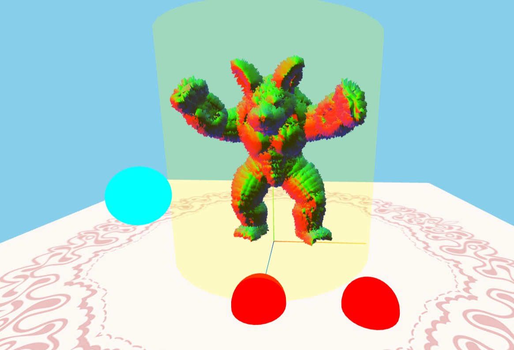
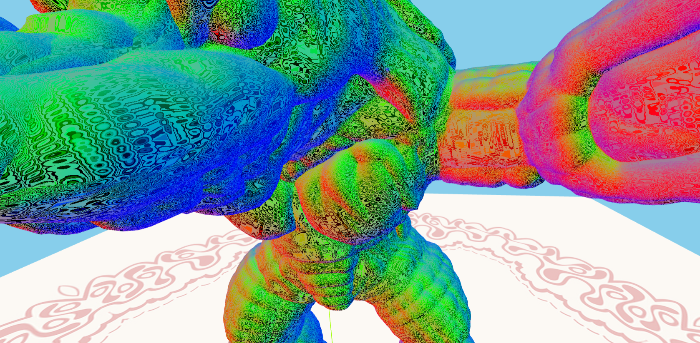

<table>
  <tr>
    <td>
      
    </td>
    <td>
      
    </td>
  </tr>
</table>

## Description de la tâche
Ce travail pratique consiste à explorer les bases du rendu 3D avec Three.js, WebGL et les shaders GLSL. 
Il est réalisé dans le cadre du cours d'Infographie (Computer Graphics).
À partir d’un gabarit fourni, le but est de comprendre la structure du programme, puis de modifier les 
vertex et fragment shaders pour corriger l’affichage de trois contrôleurs rouges et ajouter des perturbations 
visuelles dynamiques au modèle 3D. Le projet inclut la communication entre le code JavaScript et les shaders, 
la gestion des entrées clavier pour déplacer les contrôleurs, ainsi que la création d’effets réactifs au son à 
l’aide du FFT. Une dernière partie propose d’expérimenter librement avec des distorsions basées sur le son, le temps 
et le bruit pour produire un rendu créatif et original.

## Informations sur l'implémentation

Pour la première partie, mon contrôleur 1 fait une déformation qui donne du volume à la forme en fonction de la hauteur et de 
l'intensité des fréquences basses. Le contrôleur 2 augmente la composante verte de la couleur en fonction de la hauteur et de 
l'intensité des fréquences moyennes. Et le contrôleur 3 augmente la composante bleue de la couleur en fonction de la hauteur 
et de l'intensité des fréquences hautes.

Pour la partie créative, les effets créatifs ne se manifestent que lorsque le contrôleur a une hauteur qui dépasse 3.0. Ceci 
est fait pour permettre aussi de voir séparément les effets de la première partie. Le contrôleur 1 applique une déformation 
géométrique générée par une fonction pseudo-aléatoire. Le contrôleur 2 applique une déformation colorimétrique en suivant la 
même fonction de génération pseudo-aléatoire et ça donne un aspect de neige de TV. Le contrôleur 3 agit aussi sur la couleur 
mais en créant des schémas circulaires basés sur les normales interpolées.